# Medical Cost Prediction — Personal Insurance

## 1. Цель
Задача — заранее оценивать стоимость полиса.
Метрика успеха для бизнеса — не точность в процентах, а ошибка в долларах. Поэтому главные метрики — `R2` (доля объясненной дисперсии), `RMSE` и `MAE`, вспомогательная — `MSE`.

## 2. Данные
- Источник: Kaggle `Medical Cost Personal Datasets` (`data/insurance.csv`).
- Размер датасета: `1338 строк x 7 колонок` (4 числовых `age, bmi, children, charges`, 3 категориальных `sex, smoker, region`).
- После очистки: `1337 x 7` (`data/cleaned_data.csv`).
- Пропусков: `0`. Полных дубликатов: `1` (строки 195=581, 1 строка - 0.075%, удален).
- Таргет `charges`: `mean 13279 / median 9386 / std 12110 / max 63770`, `skew 1.51` — сильное смещение вправо, топ-10 почти все `smoker=yes`.

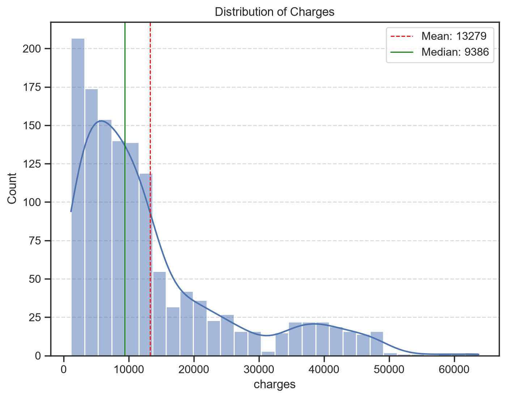

## 3. Что сделано по шагам
- `01_data_exploration_and_cleaning.ipynb` — описание 7 признаков, `info/describe`, проверка пропусков и дубликатов, удаление 1 дубликата, `describe` таргета, сохранение `cleaned_data.csv`.
- `02_visualization_and_analysis.ipynb` — EDA: распределения числовых, баланс категориальных, violin/box/bar `charges` в разрезах `smoker/sex/region/children`, scatter `age/bmi x smoker`, корреляции Pearson/Spearman, группы `age` и `bmi` по ВОЗ через `groupby.size+median`. Графики сохранены в `img/`.
- `03_feature_engineering_and_prediction.ipynb` — 3 флага (`is_parent, is_many_children, is_obesity`) + группы `age_group, bmi_cat`, сплит `train 1069 / test 268` с `random_state=42`, `ColumnTransformer` (`StandardScaler` + `OneHotEncoder(drop=first)`), 5 пайплайнов, выбор лучшего по `R2`, тюнинг `GridSearchCV`, диагностика, сохранение `models/model.pkl` и демо на 3 клиентах.

## 4. Визуализация и выводы
Числовые признаки спокойные: возраст равномерно 18-64, BMI сконцентрирован около 30.6, у 42.8% детей 0:

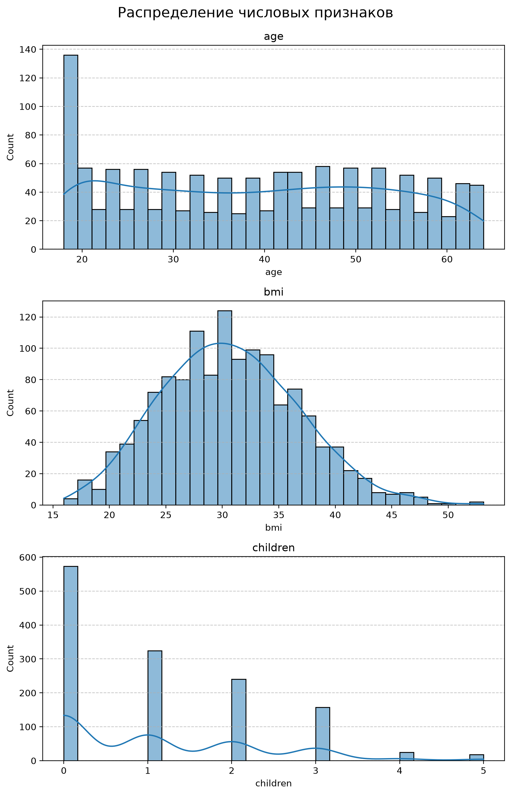

Главный драйвер — курение: `median no 7345 vs yes 34456`, `mean 8440 vs 32050`. Пол нейтрален `9412 vs 9377`, регион в коридоре `8798-10057`:

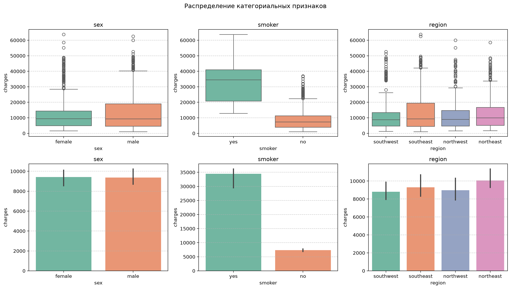

Взаимодействия решают: до `bmi 30` облака перемешаны, после 30 курильщики отрываются на 35-60 тысяч, а некурящие остаются внизу. По возрасту та же картина — три страты: нижняя полого растет, верхняя круто уходит вверх:

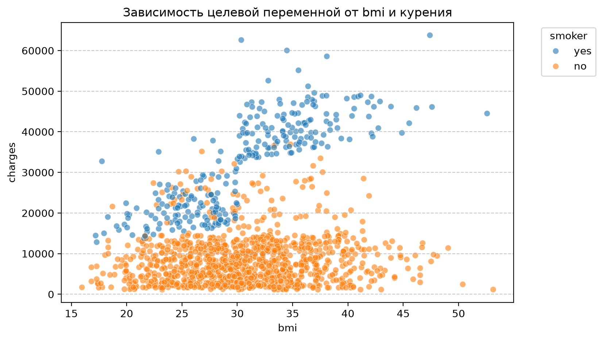
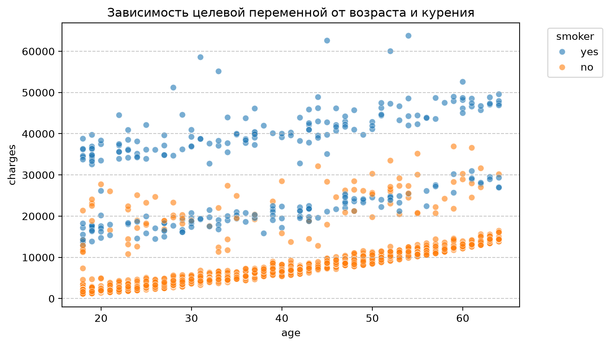


Корреляции слабые и нелинейные: `age-charges ~0.30, bmi ~0.20, children ~0.07`:

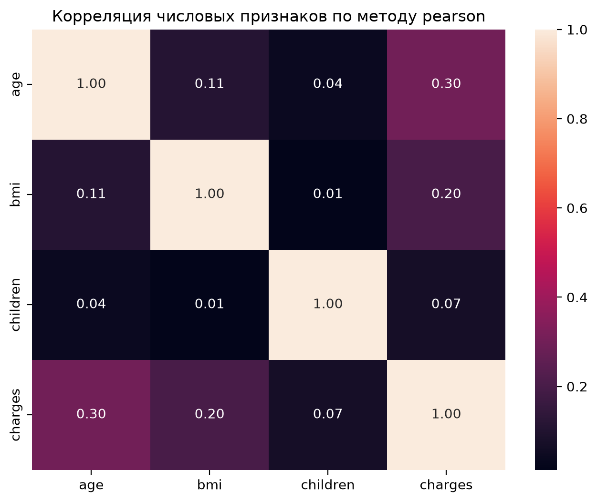

Возраст монотонно растит медиану `3220 / 6798 / 11187 / 14255`, BMI работает в связке с курением после 30:

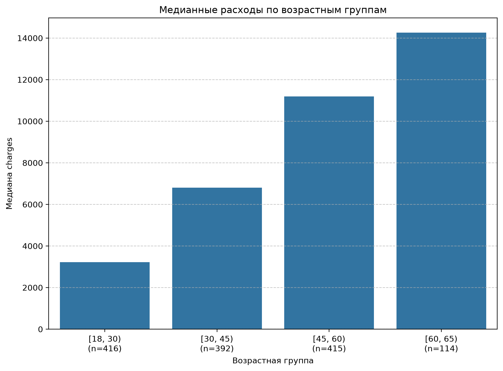
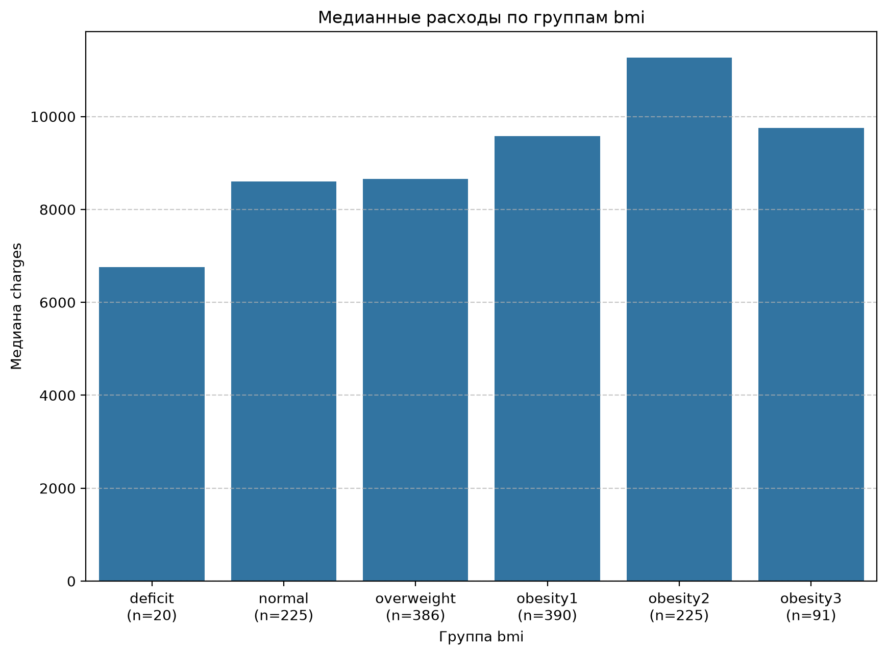

## 5. Модели и результаты

### 5.1. Что означают метрики (расшифровка)
| Метрика | Что показывает | Почему важна здесь |
|---|---|---|
| `R2 (0.899)` | Доля объясненной дисперсии цены | Главная: насколько тариф ловит разброс |
| `MAE (2449)` | Средняя ошибка в долларах | Цена ошибки для клиента — понятна бизнесу |
| `RMSE (4312)` | Ошибка с весом крупных промахов | Показывает риск на дорогих полисах |
| `MSE` | Квадрат ошибки | Техническая, для оптимизации |

### 5.2. Сравнение моделей (один сплит, `random_state=42`)
| Модель | R2 | RMSE | MAE | Читать так |
|---|---|---|---|---|
| **RandomForest (300 деревьев)** | **0.8795** | **4706** | **2666** | Лучший: ловит нелинейность smoker x bmi |
| Lasso | 0.7983 | 6089 | 4400 | Уровень линеек |
| Linear | 0.7979 | 6094 | 4406 | Бейзлайн для объяснения тарифа |
| Ridge | 0.7978 | 6095 | 4403 | Как Linear |
| SVR | -0.134 | 14435 | 9273 | Дефолтный RBF не работает на суммах в десятки тысяч — антипример |

Лучшая по `R2/MAE` — `RandomForest`. Ее тюнили через `GridSearchCV (cv=5, scoring=r2)` по сетке `n_estimators / max_depth / min_samples_leaf`.

### 5.3. Финал после тюнинга
Лучшие параметры: `max_depth 10, min_samples_leaf 5, n_estimators 400` при `CV 0.837`.
Тест: `R2 0.899 / MSE 18590313 / RMSE 4312 / MAE 2449`.
Средняя ошибка около двух с половиной тысяч при ценах от 1 до 63 тысяч; на дорогих полисах ошибаемся сильнее — закладываем резерв.

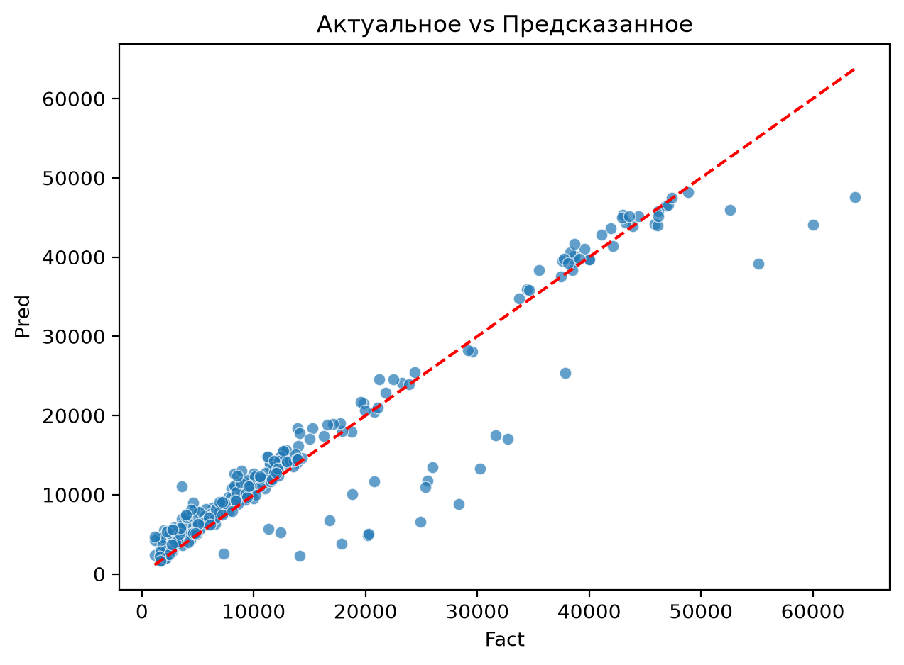
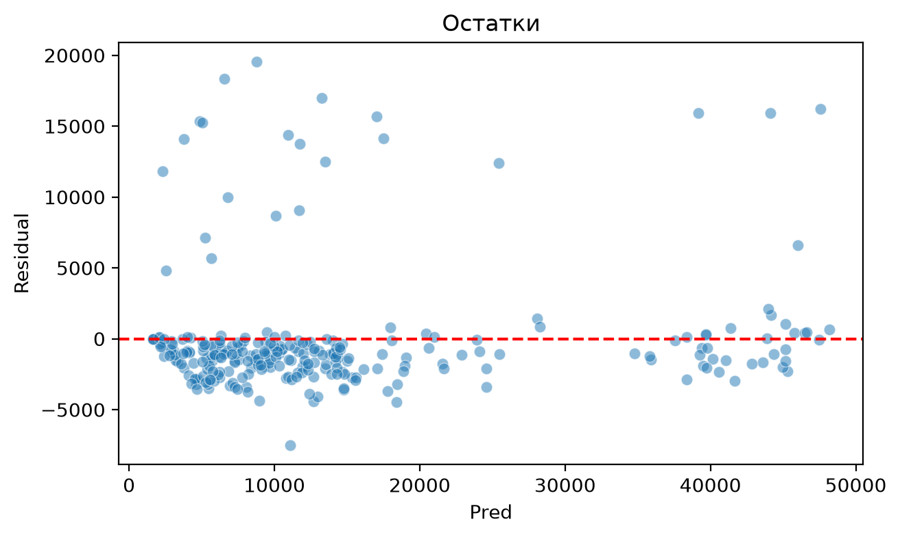

### 5.4. Что влияет на цену (важности RF)
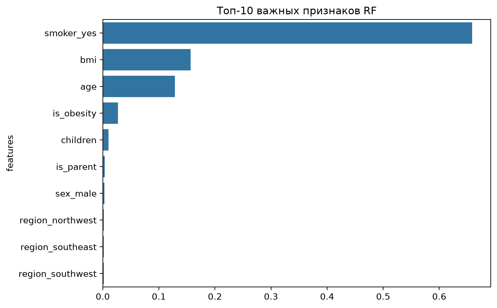
| Признак | Importance | Читать так |
|---|---|---|
| `smoker_yes` | 0.659 | Доминирует |
| `bmi` | 0.157 | Работает в связке с курением |
| `age` | 0.129 | Монотонный рост из EDA |
| `is_obesity` | 0.027 | Флаг ожирения после 30 |
| `children / is_parent / sex_male / region_*` | <0.011 | Шум, в тариф не идут |
Картина совпадает с EDA из раздела 4 — модель выучила то же, что увидели глазами.

### 5.5. Демо
В конце `03` ячейка-демо: 3 типовых клиента через `add_features + best.predict`:
- 25 лет, некурящая, bmi 22.5 → ~$5699
- 45 лет, курящий, bmi 34.0 → ~$43413
- 52 года, курящая, bmi 31.5 → ~$44105

## 6. Структура и запуск
```
01_data_exploration_and_cleaning.ipynb
02_visualization_and_analysis.ipynb
03_feature_engineering_and_prediction.ipynb
data/*.csv, img/*.png, models/model.pkl
requirements.txt
```
Запуск:
```
python -m venv env
env\Scripts\activate
pip install -r requirements.txt
jupyter lab
# затем Kernel -> Restart & Run All по порядку 01 -> 02 -> 03
```

## 7. Ограничения и дальше
- Всего 1337 строк, оценка точечная на одном сплите; `Test 0.899 выше CV 0.837` 

